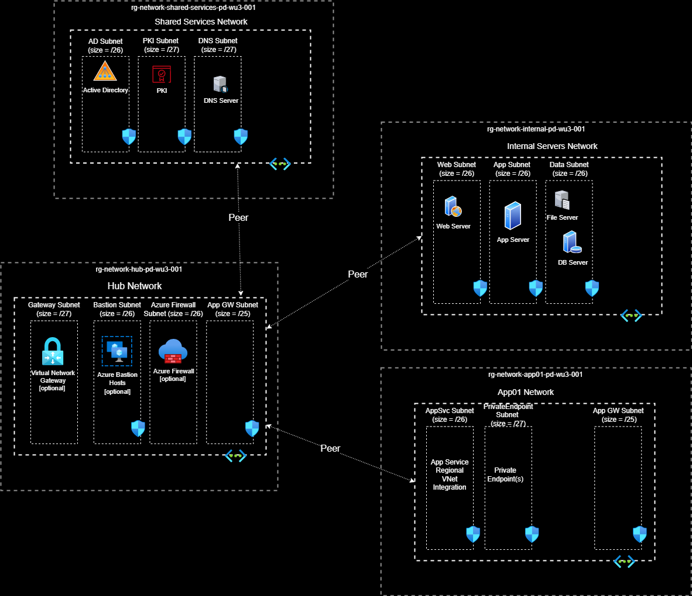

# Deploy a Hub and Spoke network using Azure Bicep

## About

This is a traditional networking topology with shared services, firewall, bastion, application gateway, and virtual network gateway subnets defined in the hub. There are two spoke networks in this example; one for internal servers and the other for DMZ workloads.

This template was designed with a modular approach where the **main** bicep file orchestrates the creation of all resources and relies on modules for supporting resources, like virtual networks and network security groups. In order to keep this template **dynamic**, the parameters file is used to control what and how many resources are deployed. Near the bottom is an explanation of the parameters file.

This deployment, in it's default state, will deploy a Hub and Spoke network (see below).


> ## Important
>
> All networking resources are deployed in multiple resource groups within a single subscription.

## Features

- Virtual Network(s)
  - Declare how many VNETs
    - Define subnet(s) within the VNET
      - Deploys an NSG per subnet with default rules
      - [optional] Declare Service Endpoint(s) per subnet
- [optional] Network logging
  - Enable network diagnostic logging on all network resources and send data to Log Analytics Workspace
- [optional] Azure Bastion
  - Add Azure Bastion service to any virtual network with AzureBastionSubnet defined and if the parameter to deployAzureBastion is set to **true**
- [optional] Azure Firewall
  - If enabled, will be deployed in the Hub Virtual Network
  - Includes:
    - Default Azure Firewall Policy
    - Azure Firewall Workbook, if Network Logging is enabled
- Hub Virtual Network
  - All VNETs created above will be connected to the hub
  - [optional] Add ExpressRoute Gateway to the hub
  - [optional] Add VPN Gateway to the hub

## Prerequisites

- [Bicep](https://docs.microsoft.com/en-us/azure/azure-resource-manager/templates/bicep-tutorial-create-first-bicep?tabs=azure-powershell) - Read through the Bicep tutorial to setup your environment.
- RBAC roles needed, any combination of the following:
  - Owner
  - Contributor (Not needed if Owner is already assigned)
  - Network Contributor (Not needed if Owner or Contributor roles are assigned)

## PowerShell Deployment

The steps outlined assumes the deployment is occurring from a workstation configured with Bicep and PowerShell. Other deployment options include Azure CloudShell via CLI or PowerShell which are not covered below. Update the parameters file before deploying.

Example 1: Deploy to Azure Commercial

```powershell
PS C:\repos\ARM\NetworkTopologies\Hub-n-Spoke> .\deployBicep.ps1
```

Example 2: Deploy to Azure Government with a specific parameters file

```powershell
PS C:\repos\ARM\NetworkTopologies\Hub-n-Spoke> .\deployBicep.ps1 -AzureEnvironment AzureUSGovernment -TemplateParameterFile .\main.parameters.gov.json
```

Example 3: Deploy to Azure Government with a specific parameters file and Azure AD tenant. The use of the TenantId would be in situations where you are a guest user in the tenant the subscription is associated with.

```powershell
PS C:\repos\ARM\NetworkTopologies\Hub-n-Spoke> .\deployBicep.ps1 -AzureEnvironment AzureUSGovernment -TemplateParameterFile .\main.parameters.gov.json -TenantId "xxxxxxxx-xxxx-xxxx-xxxxxxxxxxxx"
```

## Parameters File

The parameters file is how to control what and how many resources are deployed. Review the following parameters in main.parameters.json before deployment:

### Top level properties

|Properties|Type|Description|Default|
|----------|----|-----------|-------|
|enableNetworkPlatformDiagnostics|bool|Create a dedicated Log Analytics Workspace to receive all network diagnostic logs|false|
|deployAzureBastion|bool|Deploy Azure Bastion|false|

### **afwConfig** (object) Parameter

Defines the properties of the Azure Firewall
|Properties|Type|Description|Default|Available Values|
|----------|----|-----------|-------|------|
|deployAzureFirewall|bool|Deploy Azure Firewall|false||
|routeAllTrafficThroughFirewall|bool|North, South, East, West traffic is routed through the Azure Firewall|true||
|afwName|string|Name of the Azure Firewall|||
|afwSkuTier|string|Specify which Azure Firewall SKU|Standard|Standard, Premium|

### **vngConfig** (object) Parameter

Defines the properties of the Virtual Network Gateway
|Properties|Type|Description|Default|Available Values|
|----------|----|-----------|-------|----------------|
|deployVirtualNetworkGateway|bool|Deploy Virtual Network Gateway|[see template]|true, false|
|virtualNetworkGatewayName|string|Name of the Virtual Network Gateway|||
|virtualNetworkGatewaySKU|string|Virtual Network Gateway SKU|[see template]|Basic, ErGw1AZ, ErGw2AZ, ErGw3AZ, HighPerformance, Standard, UltraPerformance, VpnGw1, VpnGw1AZ, VpnGw2, VpnGw2AZ, VpnGw3, VpnGw3AZ, VpnGw4, VpnGw4AZ, VpnGw5, VpnGw5AZ|
|virtualNetworkGatewayGeneration|string|Virtual Network Gateway Generation|[see template]|Generation1, Generation2|
|virtualNetworkGatewayType|string|Type of Gateway|[see template]|ExpressRoute, Vpn|
|virtualNetworkGatewayVpnType|string|Gateway routing type|RouteBased|PolicyBased, RouteBased|
|virtualNetworkGatewayEnableBGP|bool|Enable BGP on gateway|[see template]|true, false|
</br>

### **lngConfig** (object) Parameter

Defines the properties of the Local Network Gateway (on premises device)
|Properties|Type|Description|Default|Available Values|
|----------|----|-----------|-------|----------------|
|localNetworkGatewayName|string|Name of the Local Network Gateway|[see template]||
|localNetworkAddressSpace|array|An array of IP addresses that are behind this gateway|[see template]||
|bgpSettings|*Not Implemented*||||
|localGatewayIpAddress|string|IP address of customer device|[see template]||
|localGatewaySharedKey|string|Shared Secret|[see template]||
</br>

### **allVnetConfigs** (object array of Virtual Network properties) Parameter

Defines the Virtual Networks and their properties
|Parameters|Type|Description|Default|Available Values|
|----------|----|-----------|-------|----------------|
|resourceGroupName|string|Name of resource group where virtual network will be deployed. (Resource Group created if it doesn't already exists)|||
|resourceGroupLocation|string|Location of resource group (westus, westus2, westus3, etc.)|||
|vnetName|string|Name of the Virtual Network|||
|vnetAddressSpace|string|IP Address Space for the Virtual Network|||
|dnsServers|array|Array of DNS IP address(es)|||
|peeringOption|string|Define whether the hub is peering to the spoke or vice versa||HubToSpoke, SpokeToHub|
|subnets|object|Array of subnet properties|||
|(subnets) name|string|Name of subnet|||
|(subnets) addressPrefix|string|CIDR notation for the subnet's address prefix|||
|(subnets) serviceEndpoints|array|Array of Service Endpoints|||

### **Tags** (object) Tag Name:Tag Value

|Parameter|Values|
|------------------------------|-----------------------------------------|
|Tags|Key Name/Value pair (Environment:Dev)|

## Bug(s)

- If deploying to West US 3, enabling network logging will fail for the NSG Flow logs. Though Microsoft documentation suggests Traffic Analytics, NSG Flow Logs with a Log Analytics Workspace, deployed in West US 3 is supported, ARM deployments typically fail.
