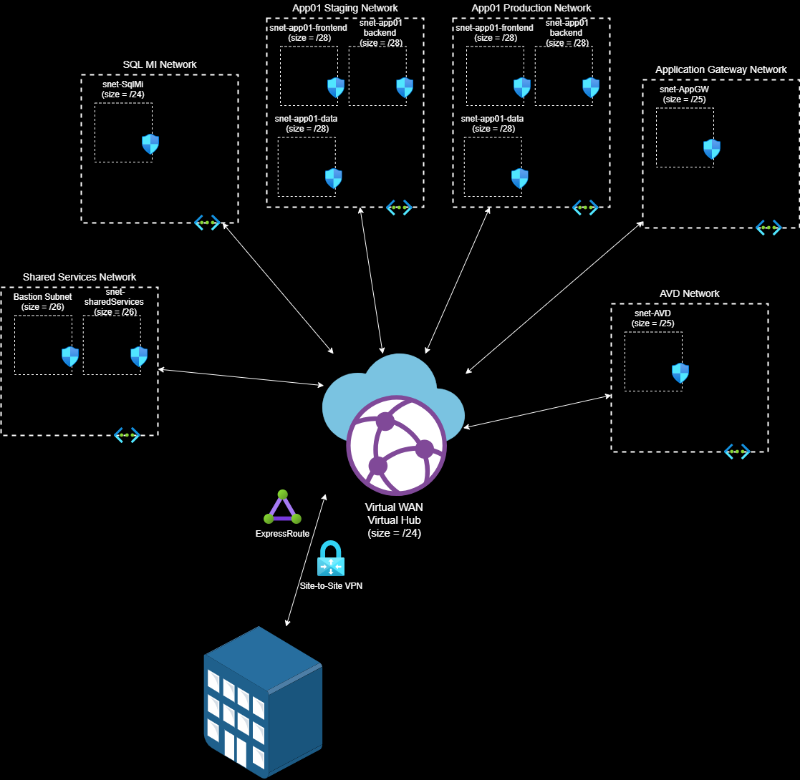

# Deploy Azure Virtual WAN with Any-to-Any routing using Azure Bicep

## About

Full mesh networking can easily be accomplished with an Azure Virtual WAN (vWAN). Azure vWAN reduces operational cost and provides a very elegant network design.

This template was designed with a modular approach where the **main** bicep file orchestrates the creation of all resources and relies on modules for supporting resources, like virtual networks and network security groups. In order to keep this template **dynamic**, the parameters file is used to control what and how many resources are deployed. Near the bottom is an explanation of the parameters file.

This deployment, in it's default state, will deploy an Any-to-Any Virtual WAN.


> ## Important
>
> All networking resources are deployed in a single resource group within a  subscription.

## Features

- Virtual Network(s)
  - Declare how many VNETs
    - Define subnet(s) within the VNET
      - Deploys an NSG per subnet with default rules
      - [optional] Declare Service Endpoint(s) per subnet
- Virtual WAN
  - Virtual Hub
    - All VNETs created above will be connected to the hub
    - [optional] Add ExpressRoute Gateway to the hub
    - [optional] Add VPN Gateway to the hub

## Prerequisites

- [Bicep](https://docs.microsoft.com/en-us/azure/azure-resource-manager/templates/bicep-tutorial-create-first-bicep?tabs=azure-powershell) - Read through the Bicep tutorial to setup your environment.
- RBAC roles needed, any combination of the following:
  - Owner
  - Contributor (Not needed if Owner is already assigned)
  - Network Contributor (Not needed if Owner or Contributor roles are assigned)

## PowerShell Deployment

The steps outlined assumes the deployment is occurring from a workstation configured with Bicep and PowerShell. Other deployment options include Azure CloudShell via CLI or PowerShell which are not covered below. Update the parameters file before deploying.

Example 1: Deploy to Azure Commercial

```powershell
PS C:\repos\ARM\SQLMI> .\deployBicep.ps1
```

Example 2: Deploy to Azure Government with a specific parameters file

```powershell
PS C:\repos\ARM\SQLMI> .\deployBicep.ps1 -AzureEnvironment AzureUSGovernment -TemplateParameterFile .\main.parameters.gov.json
```

Example 3: Deploy to Azure Government with a specific parameters file and Azure AD tenant. The use of the TenantId would be in situations where you are a guest user in the tenant the subscription is associated with.

```powershell
PS C:\repos\ARM\SQLMI> .\deployBicep.ps1 -AzureEnvironment AzureUSGovernment -TemplateParameterFile .\main.parameters.gov.json -TenantId "xxxxxxxx-xxxx-xxxx-xxxxxxxxxxxx"
```

## Parameters File

The parameters file is how to control what and how many resources are deployed. Review the following parameters in main.parameters.json before deployment:

### Top level properties

|Properties|Values (description)|
|------------------------------|-----------------------------------------|
|deployAzureBastion|Deploy Azure Bastion (true,false)|

### **vWanConfig** (object) Parameter

Defines the properties of the Virtual WAN
|Properties|Values (description)|
|------------------------------|-----------------------------------------|
|vWanName|Name of the Virtual WAN|
|vHubName|Name of the Virtual Hub|
|vHubAddressPrefix|IP Address Prefix of the Virtual Hub (10.0.0.0/24)|
|deployErGateway|Deploy an ExpressRoute Gateway in the Virtual Hub (true, false)|
|erGatewayScaleUnit|How many ExpressRoute Gateway scale units (1 - 20)|
|deploySecuredHub|Enable Azure Firewall in the Virtual Hub (not implemented yet)|
|deployVpnGateway|Deploy a Site to Site VPN Gateway in the Virtual Hub (true, false)|
|vpnGatewayScaleUnit|How many VPN Gateway scale units (1 - 20)|
</br>

### **allVnetConfigs** (object array of Virtual Network properties) Parameter

Defines the Virtual Networks and their properties
|Parameters|Values (description)|
|------------------------------|-----------------------------------------|
|vnetName|Name of the Virtual Network|
|vnetAddressSpace|IP Address Space for the Virtual Network|
|dnsServers|Array of DNS IP address(es)|
|peeringOption|SpokeToHub (default value for all VNETs that will be connected to the hub)|
|subnets|Array of subnet properties|
|(subnets) name|Name of subnet|
|(subnets) addressPrefix|CIDR notation for the subnet's address prefix|
|(subnets) serviceEndpoints|Array of Service Endpoints|