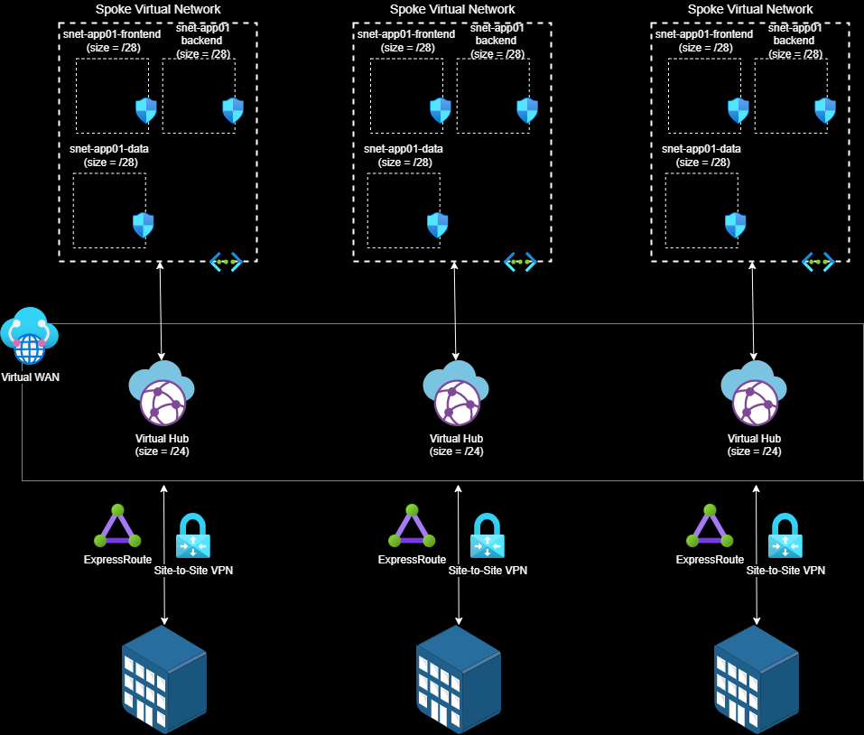

# Deploy Azure Virtual WAN with multiple hubs using Azure Bicep

## About

This deployment includes an Azure Virtual WAN with multiple virtual hubs deployed to different regions. It also simulates an 'on-prem' data center by deploying a virtual network gateway (VPN) that connects to its regional virtual hub via S2S.

This template was designed with a modular approach where the **main** bicep file orchestrates the creation of all resources and relies on modules for supporting resources, like virtual networks and network security groups. In order to keep this template **dynamic**, the parameters file is used to control what and how many resources are deployed. Near the bottom is an explanation of the parameters file.

This deployment, in it's default state, will deploy an Any-to-Any Virtual WAN.


> ## Important
>
> All networking resources are deployed in a single resource group within a  subscription.

## Features

- Virtual Network(s)
  - Declare how many VNETs
    - Define subnet(s) within the VNET
      - Deploys an NSG per subnet with default rules
      - [optional] Declare Service Endpoint(s) per subnet
- [optional] Azure Bastion
  - Add Azure Bastion service to any virtual network with AzureBastionSubnet defined and if the parameter to deployAzureBastion is set to **true**
- Virtual WAN
  - Virtual Hub
    - All VNETs created above will be connected to the hub
    - [optional] Add ExpressRoute Gateway to the hub
    - [optional] Add VPN Gateway to the hub
- Simulated On-Premises Data center
  - Define a single Virtual Network with multiple subnets
  - Define the Virtual Network Gateway S2S resource

## Prerequisites

- [Bicep](https://docs.microsoft.com/en-us/azure/azure-resource-manager/templates/bicep-tutorial-create-first-bicep?tabs=azure-powershell) - Read through the Bicep tutorial to setup your environment.
- RBAC roles needed, any combination of the following:
  - Owner
  - Contributor (Not needed if Owner is already assigned)
  - Network Contributor (Not needed if Owner or Contributor roles are assigned)

## PowerShell Deployment

The steps outlined assumes the deployment is occurring from a workstation configured with Bicep and PowerShell. Other deployment options include Azure CloudShell via CLI or PowerShell which are not covered below. Update the parameters file before deploying.

Example 1: Deploy to Azure Commercial

```powershell
PS C:\repos\ARM\NetworkTopologies\VirtualWan-MultiRegion-S2S> .\deployBicep.ps1
```

Example 2: Deploy to Azure Government with a specific parameters file

```powershell
PS C:\repos\ARM\NetworkTopologies\VirtualWan-MultiRegion-S2S> .\deployBicep.ps1 -AzureEnvironment AzureUSGovernment -TemplateParameterFile .\main.parameters.gov.json
```

Example 3: Deploy to Azure Government with a specific parameters file and Azure AD tenant. The use of the TenantId would be in situations where you are a guest user in the tenant the subscription is associated with.

```powershell
PS C:\repos\ARM\NetworkTopologies\VirtualWan-MultiRegion-S2S> .\deployBicep.ps1 -AzureEnvironment AzureUSGovernment -TemplateParameterFile .\main.parameters.gov.json -TenantId "xxxxxxxx-xxxx-xxxx-xxxxxxxxxxxx"
```

## Parameters File

The parameters file is how to control what and how many resources are deployed. Review the following parameters in main.parameters.json before deployment:

### Top level properties

|Properties|Values (description)|
|------------------------------|-----------------------------------------|
|deployAzureBastion|Deploy Azure Bastion (true,false)|

### **vWanConfig** (object) Parameter

Defines the properties of the Virtual WAN
|Properties|Values (description)|
|------------------------------|-----------------------------------------|
|vWanName|Name of the Virtual WAN|
|allowBranchToBranchTraffic|(true, false)|
|allowVnetToVnetTraffic|(true, false)|
|type|Standard or Basic|

### **vWanHubs** object array parameter

Defines the properties of the Virtual Hub(s)
|Properties|Values (description)|
|------------------------------|-----------------------------------------|
|vHubName|Name of the Virtual Hub|
|location|Azure Region (any valid region, like eastus2)
|vHubAddressPrefix|IP Address Prefix of the Virtual Hub (10.0.0.0/24)|
|deployErGateway|Deploy an ExpressRoute Gateway in the Virtual Hub (true, false)|
|erGatewayScaleUnit|How many ExpressRoute Gateway scale units (1 - 20)|
|deploySecuredHub|Enable Azure Firewall in the Virtual Hub (true, false)|
|azureFirewallSkuTier|Set the SKU of the Firewall (Standard, Premium)
|deployVpnGateway|Deploy a Site to Site VPN Gateway in the Virtual Hub (true, false)|
|vpnGatewayScaleUnit|How many VPN Gateway scale units (1 - 20)|

#### **spokeVnets** object array Parameter

Defines the virtual (spoke) networks attached to the Virtual Hub
|Properties|Values (description)|
|------------------------------|-----------------------------------------|
|vnetName|Name of the Virtual Network|
|vnetAddressSpace|IP Address Space for the Virtual Network|
|dnsServers|Array of DNS IP address(es)|
|subnets|Array of subnet properties|
|(subnets) name|Name of subnet|
|(subnets) addressPrefix|CIDR notation for the subnet's address prefix|
|(subnets) serviceEndpoints|Array of Service Endpoints (see sample parameters file)|

#### **onPremSite** object parameter

Defines the simulate on-premises network resources that will connect via S2S to the virtual hub gateway
|Properties|Type|Description|Default|Available Values|
|----------|----|-----------|-------|----------------|
|deployVirtualNetworkGateway|bool|Deploy Virtual Network Gateway|[see template]|true, false|
|virtualNetworkGatewayName|string|Name of the Virtual Network Gateway|||
|virtualNetworkGatewaySKU|string|Virtual Network Gateway SKU|[see template]|VpnGw1, VpnGw1AZ, VpnGw2, VpnGw2AZ, VpnGw3, VpnGw3AZ, VpnGw4, VpnGw4AZ, VpnGw5, VpnGw5AZ|
|virtualNetworkGatewayGeneration|string|Virtual Network Gateway Generation|[see template]|Generation1, Generation2|
|virtualNetworkGatewayType|string|Type of Gateway|[see template]|ExpressRoute, Vpn|
|virtualNetworkGatewayVpnType|string|Gateway routing type|RouteBased|PolicyBased, RouteBased|
|virtualNetworkGatewayEnableBGP|bool|Enable BGP on gateway|[see template]|true, false|
|virtualNetworkGatewayASN|int|Set the ASN for the VPN gateway|[see template]|(see docs for allowed ranges)|
|vnetName|string|Name of the Virtual Network|[see template]||
|vnetAddressSpace|string|IP Address Space for the Virtual Network|[see template]||
|dnsServers|array|Array of DNS IP address(es)|[see template]||
|subnets|object array|Array of subnet properties|[see template]||
|(subnets) name|string|Name of subnet|[see template]||
|(subnets) addressPrefix|string|CIDR notation for the subnet's address prefix|[see template]||
|(subnets) serviceEndpoints|array|Array of Service Endpoints|[see template]||
